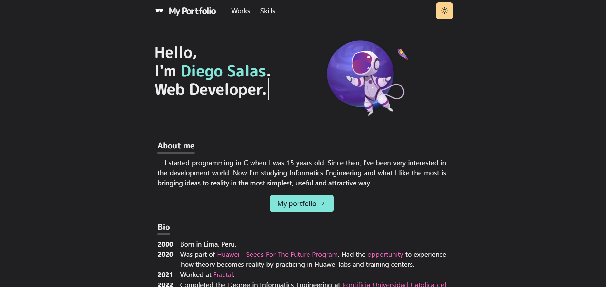

## Stack
Hi! I'm Diego Salas. 22. Software Developer. You can read about me [here](https://portfolio-diegosalasmartinez.vercel.app/)

## Stack

- [Next.js](https://nextjs.org/) - A React framework with hybrid static & server rendering, and route pre-fetching, etc.
- [Chakra UI](https://chakra-ui.com/) - A simple, modular and accessible component library for React
- [Framer Motion](https://www.framer.com/motion/) - An animation library for React

## Attribution

- [Freepik - Flaticon](https://www.flaticon.com/free-icons/briefcase) - A project with multiple illustrations, icons, mockups and presentation templates

## License

MIT License.
